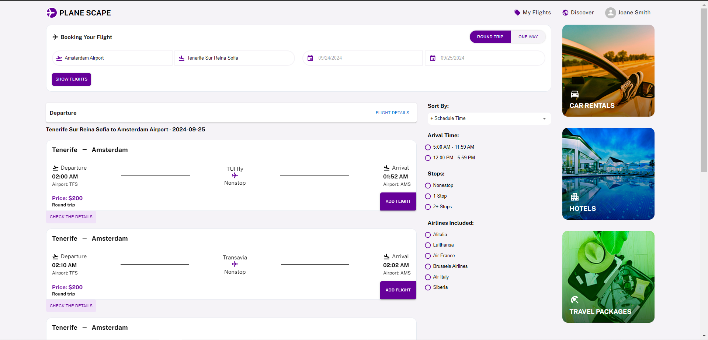

# Proje Adı

## Gereksinimler

1. **Docker Desktop**
2. **Önerilen 8GB RAM**
3. **Önerilen en az boş 5GB depolama alanı**

## Uygulamayı Nasıl Çalıştırırım?

1. **Docker Desktop'u açın.** Eğer Docker kurulumunuz yoksa, [docker.com](https://www.docker.com/) adresinden Docker'ı bilgisayarınıza kurun ve Docker Desktop'u açın.
2. **Terminali açın** ve proje dizinine gidin.
3. Aşağıdaki komutu çalıştırın:
   ```bash
   docker-compose up --build
   ```
4. Proje ayağa kalktıktan sonra http://localhost:3000/ adresini ziyaret edebilirsiniz

Uygulama Nasıl Kullanılır ?

uygulama ilk açıldığında yukarıdaki ekran sizi karşılayacaktır.

Burada uçuşları göster butonuna basmadan önce kalkış ve iniş noktalarının seçili olduğundan emin olunması gerekmektedir.

One Way Trip

Yukarıda örnek bir One Way Trip aramasını görmektesiniz. Burada kalkış Amsterdam havalimanı ve Tenerife Sur Reina Sofia ya iniş yapacağını ve bu uçuşun 09/24/2024 tarihine olacağını kalkış saatine göre sıralayarak gösterioruz.

Book flight butonuna bastığımızda ilk rezervasyonumuzu yapmış oluyoruz.

Bu bizi uçuşlarım sayfasına yönlendiriyor ve uçuşu mongo dbye kaydediyor.

Round Trip nasıl kullanılır ?

Yukarıda round trip seçili bir aramanın nasıl olduğunu görüyorsunuz.
1- İlk olarak gidiş için bir uçuş seçmeliyiz.

İlk uçuşumuz seçildikten sonra dönüş için dönüş tarihine göre filtrelenmiş uçaklar karşımıza geliyor.
2- Buradan bir uçuşu seçmemiz gerekmektedir.

3- İkinci seçim yapıldıktan sonra uçuşlar listesinin üzerinde yukarıdaki resimde size gösterdiğim sekmeyi göreceksinzi.
4- Bu sekmedeki Book Flight butonuna basıldığında uçuşunuz rezerve edilecek ve uçuşlarım sekmesinden takip edilebilir bir hale gelecektir.

Kullanılan Teknolojiler Hakkında

1. **Docker**: Uygulamanın derlenip kolay çalıştırılması için kullanılmaktadır.
2. **Docker'da 3 tane Node.js server çalışmaktadır**:
   - **Proxy Service**: Bu serverın eklenmesindeki amaç, Schiphol sunucularına direkt React'tan istek gönderdiğimizde CORS hatası ile karşılaşmamızdır. Bunun için en mantıklı çözüm bir proxy serverdır.
   - **Iata Service**: Uçakların rotasyonlarını seçmemizde yardımcı olan bu server, Schiphol API'da destination API rota seçimlerini destekleyecek esneklikte değildir ve hızlı metin aramayı desteklememektedir. Bunun için bu server, frontend ve Elasticsearch arasındaki bağlantıyı kurmaktadır.
   - **Booking Service**: Bu servis, rezervasyonları MongoDB'ye kaydetmemizi sağlayan servistir.
3. **Elasticsearch**: Hızlı havalimanı ve şehir arama seçenekleri için kullanılmaktadır.
4. **MongoDB**: Rezervasyonların saklandığı databasedir.
5. **React**: Uygulamanın frontend'i için kullanılmıştır.
   - **Webpack**: Uygulamanın build edilip kontrol aşamasında daha hızlı bir UI sunmak için eklenmiştir.
   - **SCSS**: Kod kalitesini arttırmak için eklenmiştir.
   - **Redux**: State management için kullanılmıştır.
   - **History Kütüphanesi**: Routing işlemleri için kullanılmıştır.
   - **Material UI**: Birçok icon ve sağladığı componentler için kullanılmıştır.
   - **TypeScript**: Tip tanımlamaları eklenerek kod okunabilirliği arttırılması amaçlanmıştır.
   - **Axios**: Node.js serverlara API istekleri atılmıştır.
   - **React-Resizable**: Popup'ların daha etkin kullanılması sağlanmıştır.
   - **Pagination**: Uçuş listelerinde pagination kullanılmıştır. Eğer seçilen güzergah ve tarihte 20'den fazla uçuş varsa, sayfa aşağı indirildikçe 20'şer 20'şer yavaş yavaş yüklenmektedir.
   - **Liste Sanallaştırma**: Uçuş listesi ve rezervasyon yapılan uçuşlarım ekranında liste sanallaştırma kullanılmaktadır. Bu yüzden binlerce ve daha fazla uçuş listelenmek istese bile DOM'da bir sorun çıkartmayacaktır ve performansımız düşmeyecektir.
